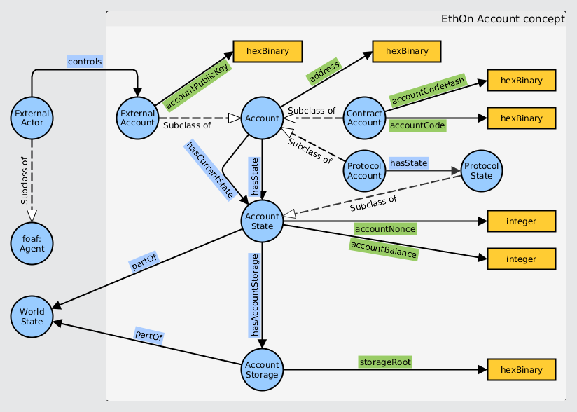
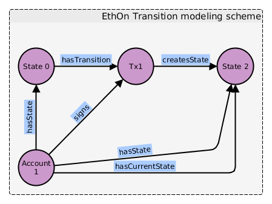
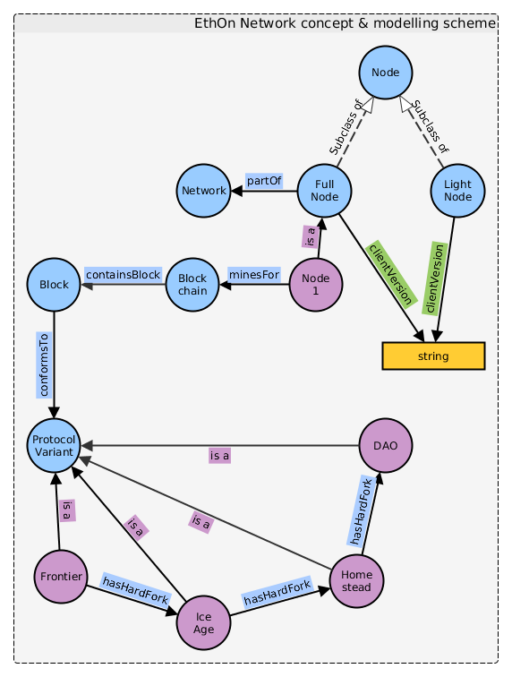

# EthOn - An Ethereum Ontology
_An Ethereum ontology that is closely aligned with the [Ethereum yellow paper](https://github.com/ethereum/yellowpaper)._

__Contributors:__
* Johannes Pfeffer (ontology engineering)
* Shahan Khatchadourian (ontology engineering)
* Herman Junge (requirements, ethereum knowledge)
* Maurycy (requirements, ethereum knowledge)
* Marian Oancea (domain knowledge)
* Casey Detrio cdetrio@gmail.com (ethereum internals)
* Alex Beregszaszi (ethereum internals)
* Stefano Bertolo <stefano@ethereum.org> (review, testing)

## Status and scope
EthOn is currently under heavy development. It is not complete, nor ever will be, probably. The goal is to model Ethereum as a [State Transition System](https://en.wikipedia.org/wiki/Transition_system).

EthOn can be used
* as a glossary of Ethereum terms
* as a learning ressource for understanding Ethereum and the yellow paper
* as a means to improve communication (among developers, among technical and non-technical people, ...)
* for checking the consistency of modeled aspects of blockchain data via reasoning
* to semantically annotate content provided by Ethereum based tools and dApps (e.g. block explorers, analysis tools, markets, ...)
(incomplete list)

## Examples
Among other things, EthOn can be used to formally describe Ethereum artefacts. 
The following [Turtle](https://www.w3.org/TR/turtle/) snippet is a description of the Genesis Block of the current Ethereum main net.
### Describing an Account

    ethereum:Account0000000000000000000000000000000000000000
        a ethon:Account ;
        rdfs:label "Genesis Address" ;
        ethon:address "0000000000000000000000000000000000000000"^^xsd:hexBinary ;
        ethon:hasState ethereum:AccountState0 ;
        rdfs:seeAlso <https://etherscan.io/address/0x0000000000000000000000000000000000000000> .
    
    ethereum:AccountState0
        ethon:accountBalance 0 ;
        ethon:accountNonce 0 .
        

### Describing a Block

    ethereum:Block0
        a ethon:Block ;
        rdfs:label "Genesis Block" ;
        rdfs:comment "This is the block with block number 0. It is the Genesis Block of the Ethereum blockchain. ;
        ethon:number 0 ;
        ethon:blockBeneficary ethereum:Account0000000000000000000000000000000000000000 ;
        ethon:blockReward 5000000000000000000 ;
        ethon:gasLimit 5000 ;
        ethon:blockNonce "0000000000000042"^^xsd:hexBinary ;
        [...]
        rdfs:seeAlso <https://etherscan.io/block/0> .

## 4 approaches to understanding EthOn
### 1. Look at the concept and modelling illustrations
#### Illustration key

#### Simplified EthOn model of Ethereum

#### Account concept

#### Block modeling scheme

#### Message concept

#### State Transition concept and modeling scheme

#### Network concept and modeling scheme

### 2. Visualize the Ontology
Visualize the ontology using [WebVOWL](http://vowl.visualdataweb.org/webvowl/).
[It should be enough to click this link](http://vowl.visualdataweb.org/webvowl/#iri=https://raw.githubusercontent.com/ConsenSys/ethereum-ontology/master/EthOn.rdf?token=ABeN2BS6JNYwG2ADzI7vBJihTu02xpgjks5YWBKpwA%3D%3D). 
WebVWOL is also developed on GitHub: https://github.com/VisualDataWeb/WebVOWL

### 3. Look at the specification
You can look at the specification that is generated automatically. Just clone the repo and open _EthOn_spec.html_ in a browser.

There is also a fancy specification generator http://hacks.michelepasin.org/ontospy/. See https://github.com/lambdamusic/OntospyWeb.

### 4. Open the ontology in Protégé
Download [Protégé](http://protege.stanford.edu/) and open the ontology file to browse around and view all assertions.
